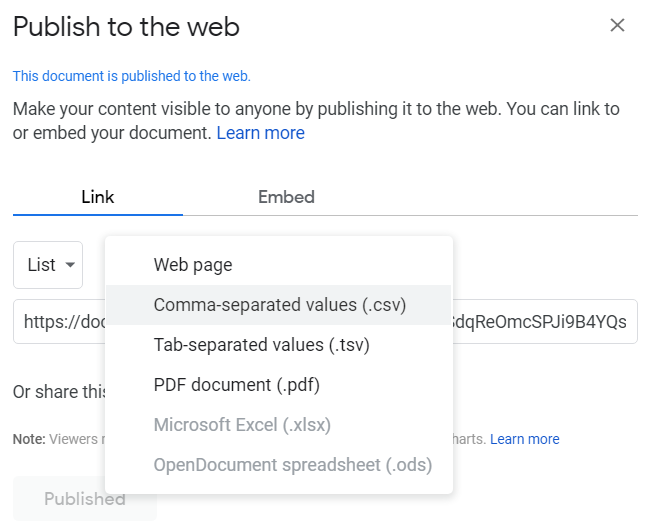

# Data Exploration

## Sources
https://www.openml.org/search?type=data
https://www.kaggle.com/datasets

Streamlit apps have a unique data flow: any time something must be updated on the screen, Streamlit reruns your entire Python script from top to bottom. See [data flow](https://docs.streamlit.io/en/stable/main_concepts.html#data-flow)

## Plotting

https://matplotlib.org/stable/api/pyplot_summary.html

### Plotly
jupyter labextension install jupyterlab-plotly // take a few minutes

## School

## Country Income, Populaiton & Life Expectancy
https://www.kaggle.com/ahmdfatihin/world-population-incomegdp-and-life-expectancy

## Tracks
### Load from Google Sheet
File => Publish to the Web
